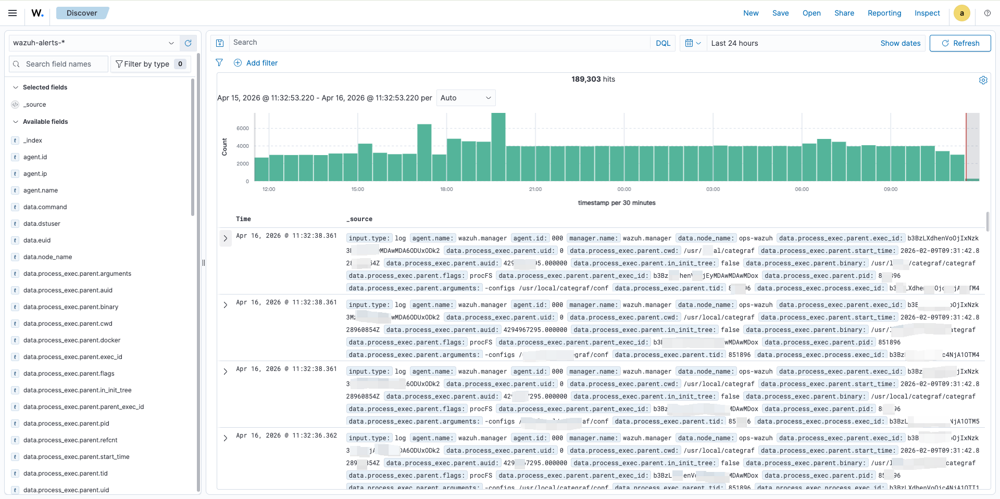
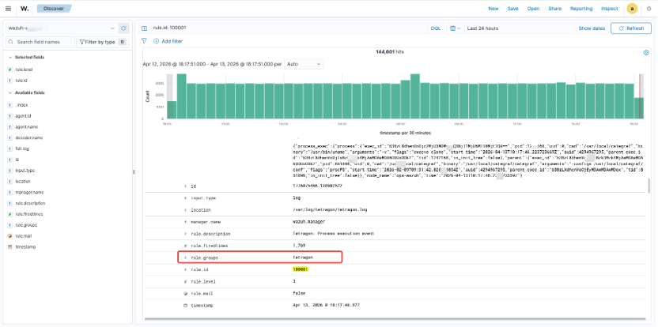
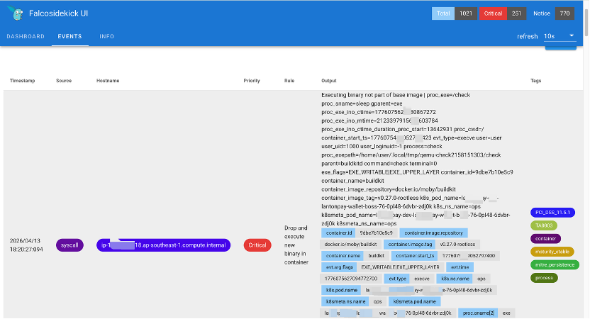
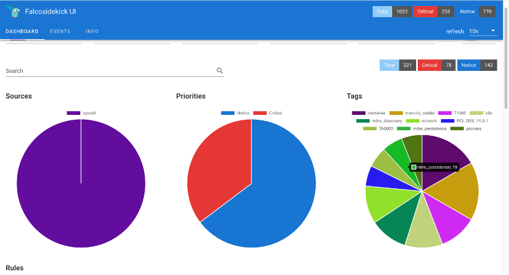
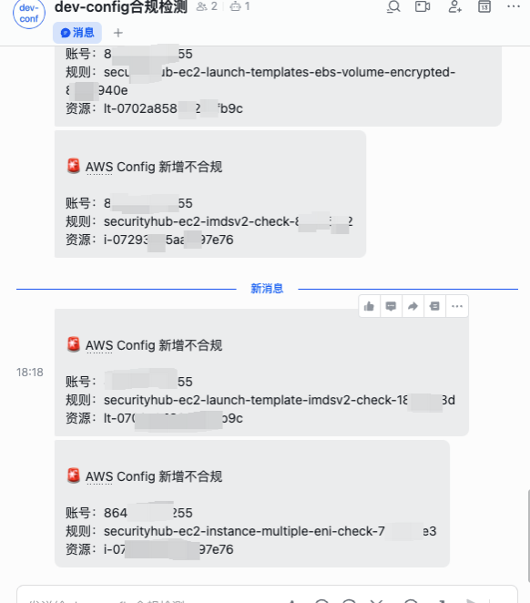
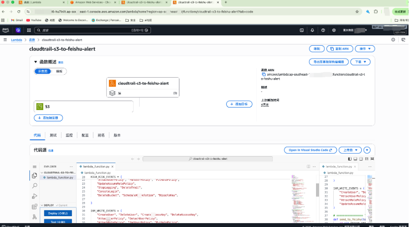
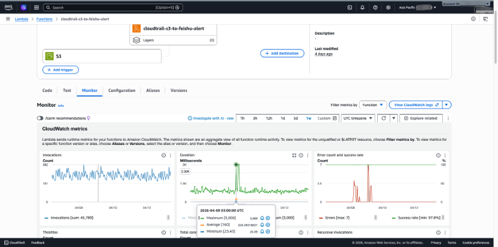

# Mini-mssp-security-platform
Production-based MSSP security platform with Wazuh, Falco, Tetragon and AWS automated alerting (SIEM + runtime + cloud security)

This system is based on a real production deployment I built and operated in a company environment.
# Mini MSSP Security Platform

This project demonstrates a production-grade security monitoring and automation platform, combining SIEM, runtime security, and cloud-native alerting pipelines.

> ⚠️ Due to company security policies, direct access to the production environment is restricted. The following screenshots and architecture are from a real deployed system (with sensitive data masked).

---

## 🧩 Architecture Overview

- **Wazuh**: Central SIEM for log collection and correlation  
- **Tetragon**: Kernel-level runtime visibility (process execution events)  
- **Falco**: Container runtime threat detection  
- **AWS CloudTrail / Config / CloudWatch**: Cloud security monitoring  
- **AWS Lambda**: Alert processing and automation  
- **Feishu / Telegram**: Real-time alert delivery  

---

## 🔐 Key Capabilities

### 1. SIEM & Log Analysis (Wazuh)

- Real-time log ingestion and correlation  
- MITRE ATT&CK mapping  
- PAM / authentication event monitoring  
- Custom rule detection  

📸 **Wazuh Dashboard**

---

### 2. Runtime Security (Falco + Tetragon)

- Container runtime threat detection (Falco)  
- Kernel-level process execution monitoring (Tetragon)  
- Integrated into Wazuh for centralized visibility  

📸 **Tetragon → Wazuh Integration**

📸 **Falco Runtime Alert**

---

### 3. Cloud Security Monitoring (AWS)

- CloudTrail high-risk operations detection  
- AWS Config compliance monitoring  
- CloudWatch anomaly detection  

📸 **AWS Alert → Feishu(Lark)**

---

### 4. Automated Alert Pipeline

- Serverless alert processing using AWS Lambda  
- Real-time notification to Feishu(Lark) / Telegram  
- Structured alert formatting and routing  

📸 **Wazuh → Telegram Alert**

📸 **Lambda Monitoring**

---

## ⚙️ Automation Design

- Event-driven architecture (CloudWatch → Lambda → Notification)  
- Extensible to workflow tools like n8n  
- Designed for low-latency alert delivery  

---

## 🏗️ Multi-Tenant Design (Concept)

- Agent grouping per client  
- Index-based data isolation (OpenSearch)  
- Alert routing per tenant  
- RBAC-ready (can integrate with Retool / Directus)  

---

## 📦 Deliverables Capability

This system can be extended into a full MSSP platform including:

- Multi-tenant management portal (Retool / Directus)  
- Workflow orchestration (n8n)  
- Billing integration (WHMCS)  
- Deployment automation (Docker / Terraform)  

---

## 💡 Summary

This project reflects real-world experience building and operating:

- SIEM platforms  
- Runtime security systems  
- Cloud-native detection pipelines  
- Automated alerting infrastructure  

Happy to walk through the architecture or adapt it to your requirements.

Note: This repository is for demonstration purposes only. 
The architecture and screenshots are based on a real production system, 
but sensitive details have been removed or anonymized.
